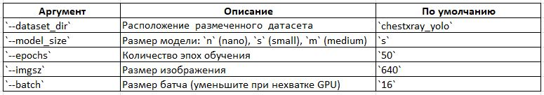

# 🔬 Система автоматической детекции патологий на рентгеновских снимках грудной клетки на основе датасета NIH ChestX-ray14 (BBox) с использованием модели YOLOv8

[](https://www.python.org/downloads/)
[](https://ultralytics.com/)


## ✨ Возможности

- 📥 Автоматическое извлечение нужных изображений из images_*.tar.gz
- 🧹 Подготовка чистого YOLO-совместимого датасета
- ⚖️ Многоклассовая модель со всеми типами заболеваний vs Бинарная модель (Abnormal / Normal)
- 🚀 Обучение YOLOv8 (nano/small/medium)
- 📊 Оценка качества (mAP50, mAP50-95)

## 😢 Проблема

Исходная многоклассовая модель показывает низкий mAP50 (~0.2) из-за малого количества размеченных данных.

## 📝 Решение

Переход к бинарной детекции ("патология есть / нет")


## 📁 Структура проекта

      ChestX-ray-Pathology-Detector-with-YOLOv8/
      ├── chestxray_yolo/              # Папка с размеченными изображениями и аннотациями для обучения модели YOLO
      │  ├── images/
      │  ├── labels/
      │  └── data.yaml
      │
      ├── dataset/ 
      │  └── images/                   # Папка с изображениями соответствующими BBox_List_2017.csv
      │
      ├── runs/                  
      │  └── detect/             
      │     └── train/
      │        └── weights/
      │           └── best.pt            # Дообученная модель YOLOv8
      │
      ├── dataset_prepare.py             # Модуль подготовки датасета (8 классов)
      ├── dataset_binary_prepare.py      # Модуль подготовки датасета (1 класс) - Бинарная детекция: "патология есть / нет"
      ├── extract_bbox_images.py         # Модуль для извлечения bbox из изображений
      ├── train_model.py                 # Модуль запуска обучения модели YOLOv8
      ├── visualize_multiclass.py.py     # Модуль инференса модели с визуализацией результатов в папке results/ *
      ├── requirements.txt               # Зависимости проекта
      └── README.md                      # Документация

## 📁 Структура папки results/ после запуска

      *
      results/                  
      ├── images/ 
      │  └── patient_chest_xray.jpg   # изображение с рамками
      ├── labels/
      │  └── patient_chest_xray.txt  # формат: class_id x_c y_c w h confidence
      └── json/
         └── patient_chest_xray.json # предказания в формате JSON

## 📄 Пример patient_chest_xray.txt

```txt
2 0.450000 0.600000 0.200000 0.300000 0.874321
6 0.750000 0.300000 0.100000 0.150000 0.642109
```

## 📄 Пример patient_chest_xray.json

```json
[
  {
    "class_id": 2,
    "class_name": "Effusion",
    "confidence": 0.8743,
    "bbox_xyxy": [120.0, 200.0, 300.0, 400.0],
    "bbox_cxcywh": [210.0, 300.0, 180.0, 200.0]
  },
  {
    "class_id": 6,
    "class_name": "Pneumonia",
    "confidence": 0.6421,
    "bbox_xyxy": [400.0, 150.0, 500.0, 250.0],
    "bbox_cxcywh": [450.0, 200.0, 100.0, 100.0]
  }
]
```

## 🖼️ Визуализированные результаты обучения модели

      ChestX-ray-Pathology-Detector-with-YOLOv8/
            └── runs/                  
               └── detect/             
                  └── train/

## 🛠️ Установка

```bash
# Клонирование репозитория
git clone https://github.com/i-koskin/ChestX-ray-Pathology-Detector-with-YOLOv8.git
cd ChestX-ray-Pathology-Detector-with-YOLOv8
```
```bash
# Создание виртуального окружения
py -m venv venv
```
```bash
source venv/bin/activate  # Linux/MacOS
```
```bash
# или
venv\Scripts\activate  # Windows
```
```bash
# Установка зависимостей
pip install -r requirements.txt
```

## 💻️ Порядок использования

### 1. Извлечение bbox из изображений:

```bash
python extract_bbox_images.py
```
### 2. Подготовка датасета для обучения модели:

```bash
python dataset_prepare.py
```
### 3. Обучение модели

```bash
python train_model.py --dataset_dir chestxray_yolo --model_size s --epochs 50 --imgsz 640 --batch 16
```
⚙️ *Аргументы командной строки:*

<p align="left">

</p>

### 4. Использование модели:

```bash
python visualize_multiclass.py
```
## 📚 Источники данных

Датасет: [NIH ChestX-ray14 Dataset](https://nihcc.app.box.com/v/ChestXray-NIHCC)

BBox аннотации: [BBox_List_2017.csv](https://nihcc.app.box.com/v/ChestXray-NIHCC/file/219760940956)
